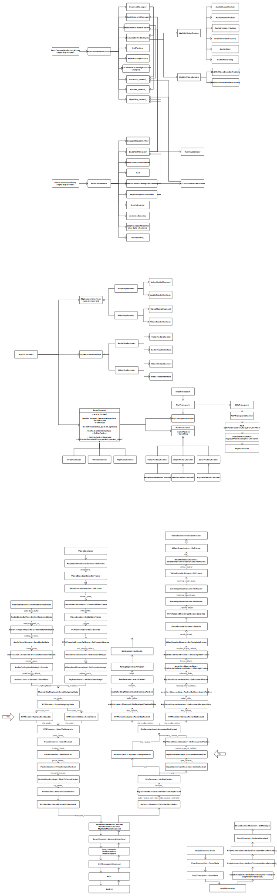

# HackWebRTC

Let's hack into WebRTC :)

## Use WebRTC static library

+ https://blog.piasy.com/2017/09/03/Use-WebRTC-Static-Library/
+ Copy header files:

``` bash
# CP='gcp' # mac
# CP='cp'  # linux

find api audio base call common_audio common_video logging media \
modules ortc p2p pc rtc_base rtc_tools sdk stats system_wrappers \
video -name "*.h" \
-exec $CP --parents '{}' <target dir> ';'
find . -maxdepth 1 -name "*.h" -exec $CP --parents '{}' <target dir> ';'
```

Tips:

+ Due to the file size limit of GitHub, I ignore `libwebrtc.a`, please extract it and put it under `app/libs/webrtc/lib/armeabi-v7a/` before building.
+ It's important to disable RTTI in your project setting if you want to use WebRTC static library, otherwise linker will fail with something like `undefined reference to 'typeinfo for rtc::MessageHandler'`.
+ You also need add some definitions in your project, refer to [here](https://chromium.googlesource.com/chromium/src/build/+/master/config/BUILDCONFIG.gn#293) and [here](https://webrtc.googlesource.com/src/+/master/BUILD.gn#123).
  - Android: `WEBRTC_POSIX`, `WEBRTC_LINUX`, `WEBRTC_ANDROID`
  - iOS: `WEBRTC_POSIX`, `WEBRTC_MAC`, `WEBRTC_IOS`

## WebRTC src extractor

`python webrtc_src_extractor.py <repo dir> <dst dir> <wanted src file, seperated by space>`

If you only want use a small part of WebRTC code, this script could help you find all related sources and headers, and copy them into `dst dir`. Note that it's just a best effort script, you may still need copy several sources manually.

## WebRTC classes and data flow


